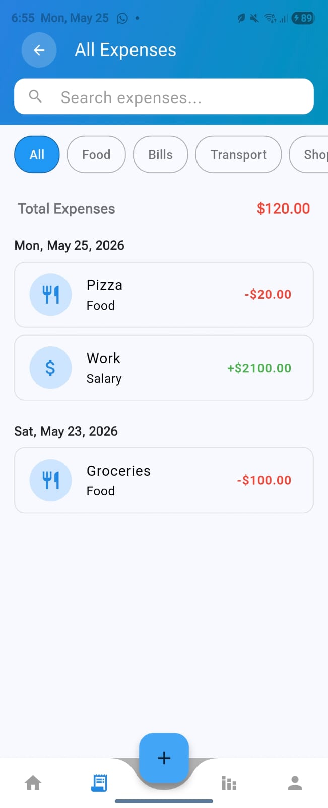

# MoneyTrackerApp
Money Tracker simplified to ease the use and reduce confusion when using a tracker app.

## Why This App?
Most expense trackers feel overwhelming when you first start — too many features, too much setup, and too much overhead.  
**MoneyTrackerApp** is designed to be simple and motivating:
- Minimal steps to add income or expenses
- Clean interface that reduces confusion
- Helps build consistency in tracking, so you stay motivated
- Focuses on clarity rather than complexity

By lowering the barrier to entry, the app makes it easier to start tracking right away and stick with it.

## Tech Stack
This app is built with:
- **Flutter** → cross-platform mobile framework  
- **Riverpod** → state management  
- **Drift (SQLite wrapper)** → offline local database with reactive queries  
- **Dart** → core programming language  
- **Material Design** → clean and intuitive UI  

## Data Safety
Your financial data is stored **locally on your device** using Drift.  
- No cloud dependency → your information never leaves your phone.  
- Works fully offline → you can track expenses and income anywhere.  
- Safer and more private → no external servers or third-party storage involved.  

## Preview
### Home

### Add Transaction

### All Transactions

### Chart

